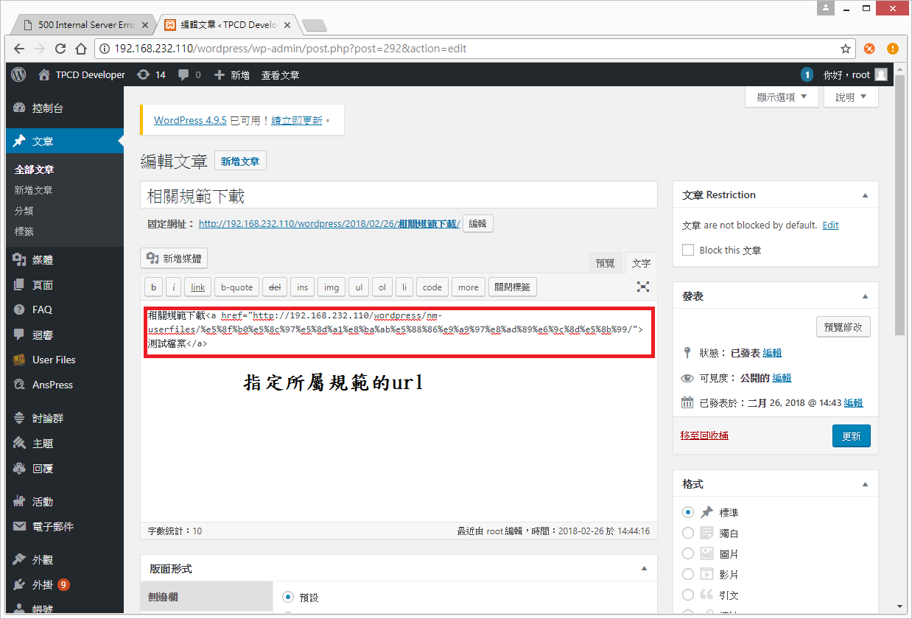
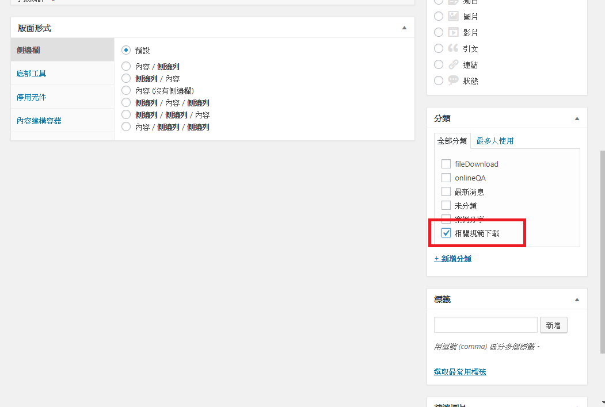
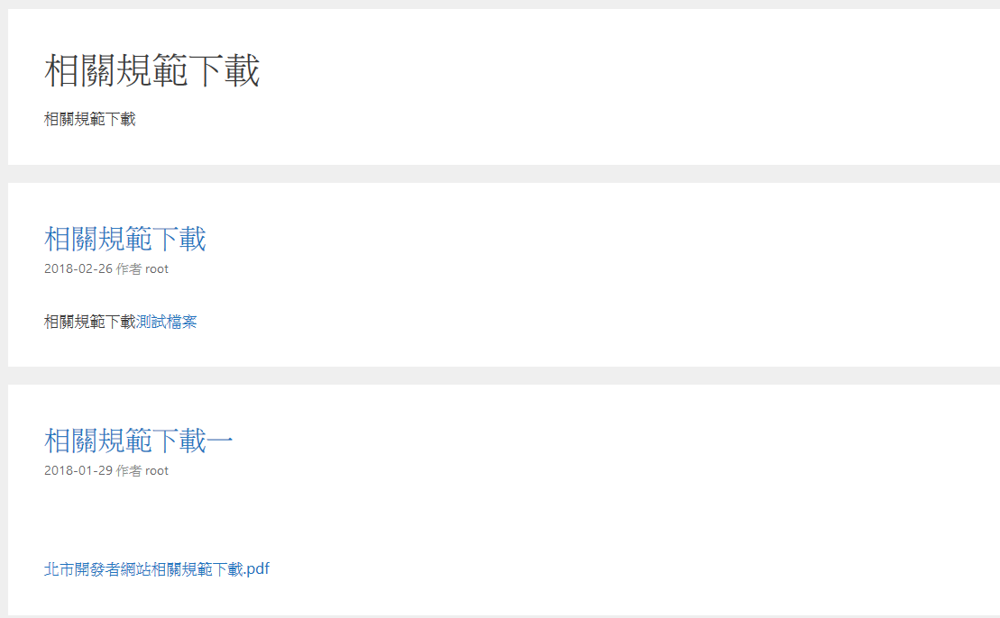

#相關規範下載 
 
 
 
### 功能說明:
### 使用wordpress介面，設定一區提供規範下載，而內容則由站相關人員整理及負責上稿

**********************************

####  上版說明

##### Step1.
#####    先以管理者身分新增wordpress文章

##### Step2.
#####    在分類中勾選(相關規範下載)的分類

##### Step2.
#####    在分類中勾選(相關規範下載)的分類

**********************************

#### 下圖為相關規範下載

