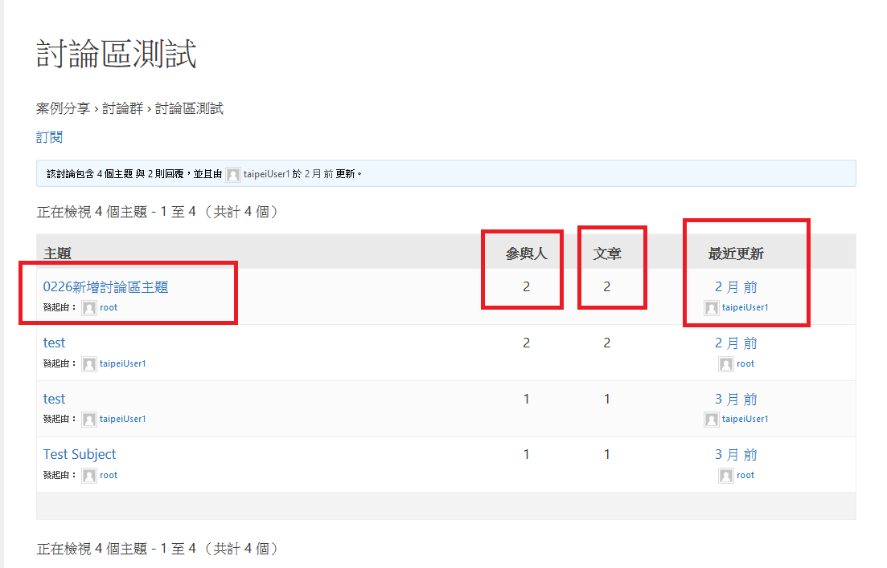
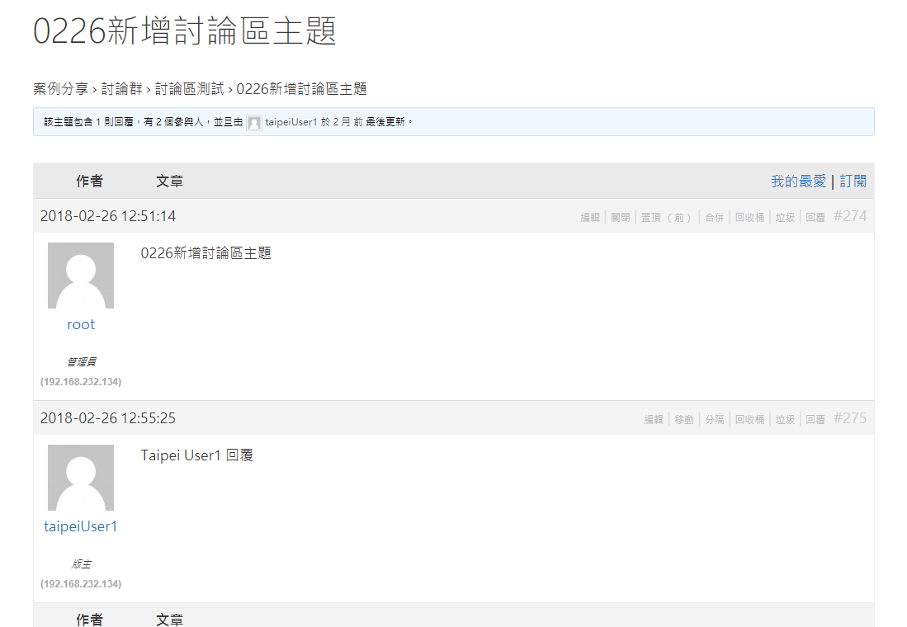
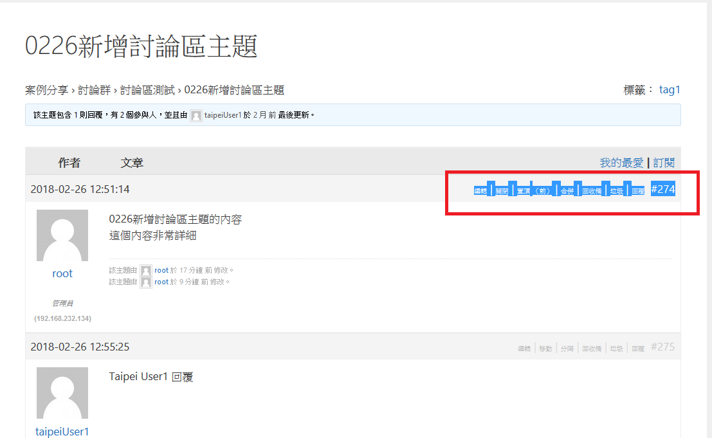
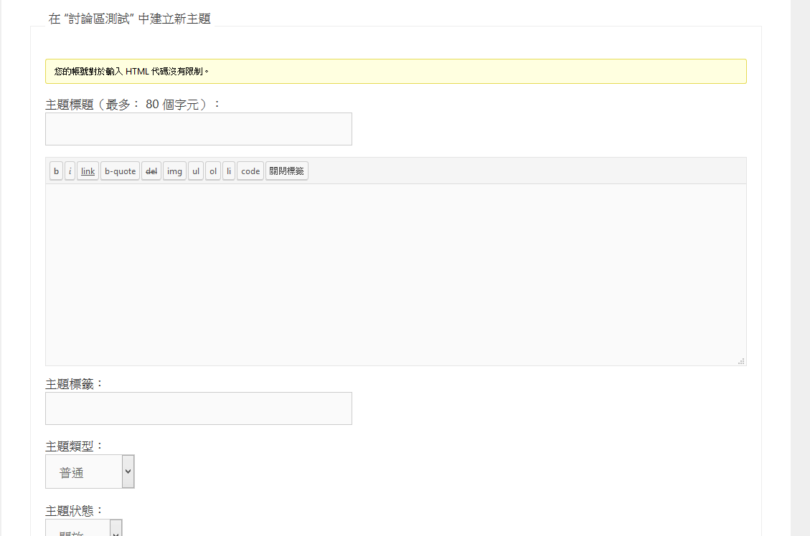

#登入台北卡開發者網站操作流程

 
 
 

### 功能說明:
### 使用wordpress之討論區plugin，提供討論區之功能，讓
### 會員可以於討論區中進行發表及討論。

*********************************************************************

### 下面分成兩部分說明:

#### 下圖(一)中會依照主題的格式以及主題的標題排列:
#### 並且分成: 
####    1.主題      (點選進入後可以觀看主題文章)
####    2.參與人數   (可以看到該主題參與人數的總數)
####    3.文章數量   (可以看到該主題討論文章的人數)       
####    4.最近更新   (最近更新時間,以及更新的人員)

#####  (圖一)

*****************************************************************
#### 下圖(二)在討論區中建立新主題之操作方式:
#### 並且分成: 
           1.編輯
               主題的標題選項   
           2.關閉
               依照使用者規定的內容,輸入內容
           3.主題標籤
               為自訂的主題標籤
           4.主題類型
               標籤可分成:
               a.普通
               b.置頂
               c.超級置頂
           5.主題狀態
               主題狀態可分成:
               a.開放
               b.關閉
               c.垃圾
               d.回收桶
               e.擱置

#####  (圖二)
***********************************************************************
#### 下圖(三)進入主題文章後的操作方式:
#### 並且分成: 
           1.編輯 
           2.關閉
           3.置頂(前)
           4.合併
           5.回收桶
           6.垃圾
           7.回復        

#####  (圖三)
***********************************************************************

#### 下圖(四)為發布新的主題內容:
#### 並且分成: 
           1.主題標題
               主題的標題選項   
           2.主題內容
               依照使用者規定的內容,輸入內容
           3.主題標籤
               為自訂的主題標籤
           4.主題類型
               標籤可分成:
               a.普通
               b.置頂
               c.超級置頂
           5.主題狀態
               主題狀態可分成:
               a.開放
               b.關閉
               c.垃圾
               d.回收桶
               e.擱置

#####  (圖四)

