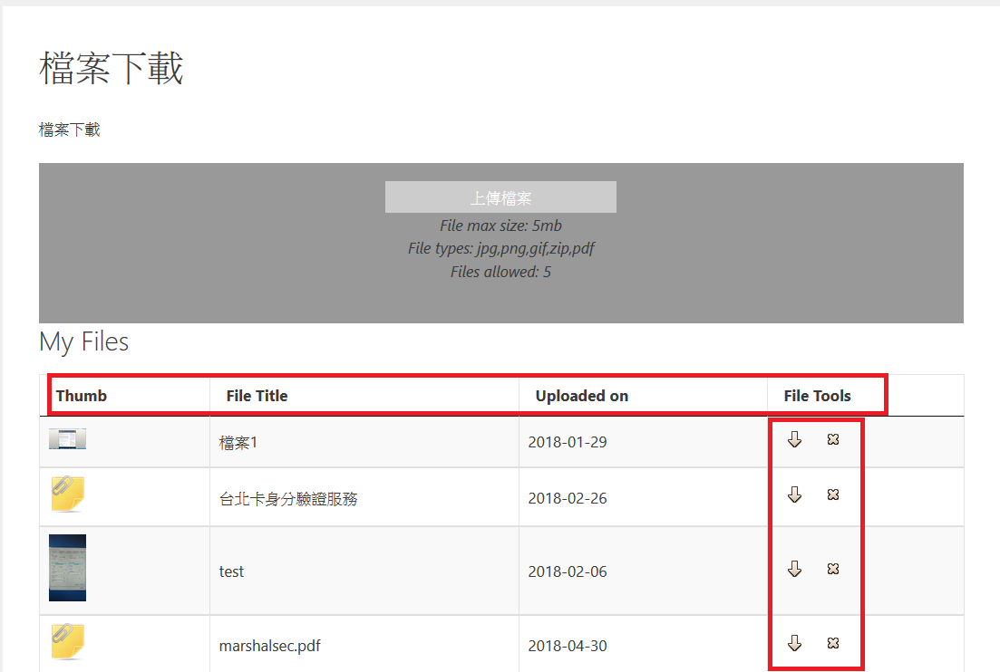

#檔案下載操作流程

###  內容說明:  使用wordpress介面，設定一區提供規範下載，而內容則由站相關人員整理及負責上稿

### 功能說明: 

       1. 內容部分:    
  
           a.分成縮圖
           b.檔案標題
           c.檔案上傳時間
           d.檔案工具的部分則可以選擇下載或刪除

### 操作說明:

         Step1. 使用者點擊右方download可以執行下載
         Step2. 使用者點擊左方刪除的部分就可以執行刪除
     