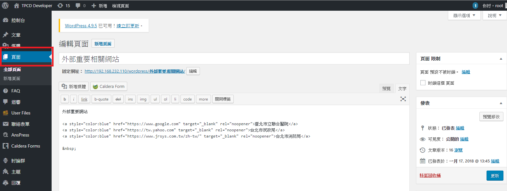
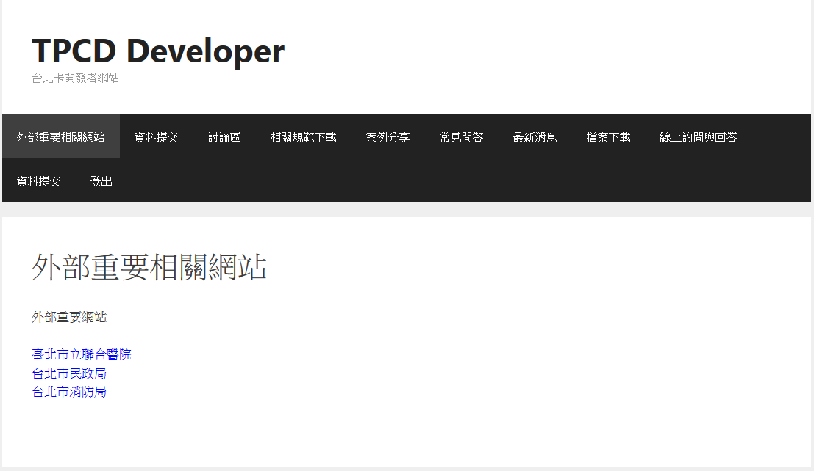

#外部重要相關網站

 
 
 
###   功能說明:
###   由Wordpress 設定站台的樣式，劃分一區作為「外部重要相關網站」區 ，會員登入後即可看見本功能的連結，點選後即可進入「外部重要相關網站」的頁面。
*************************************************

由管理者於管理介面的頁面    
並新增重要的外部網站連結於wordpress右方頁面

#### 下圖為外部重要相關網站的顯示部分
