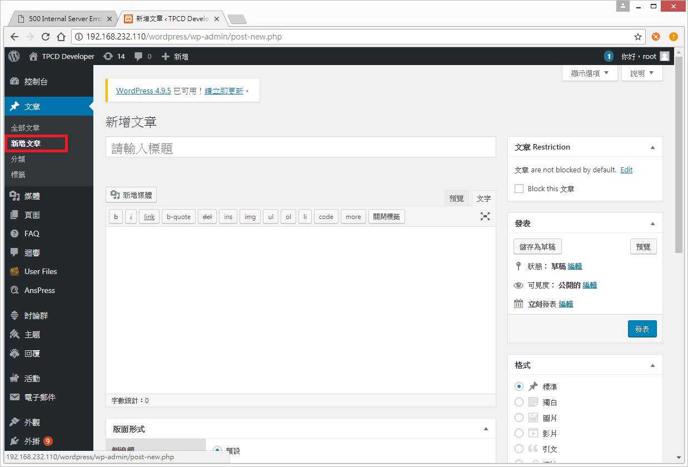
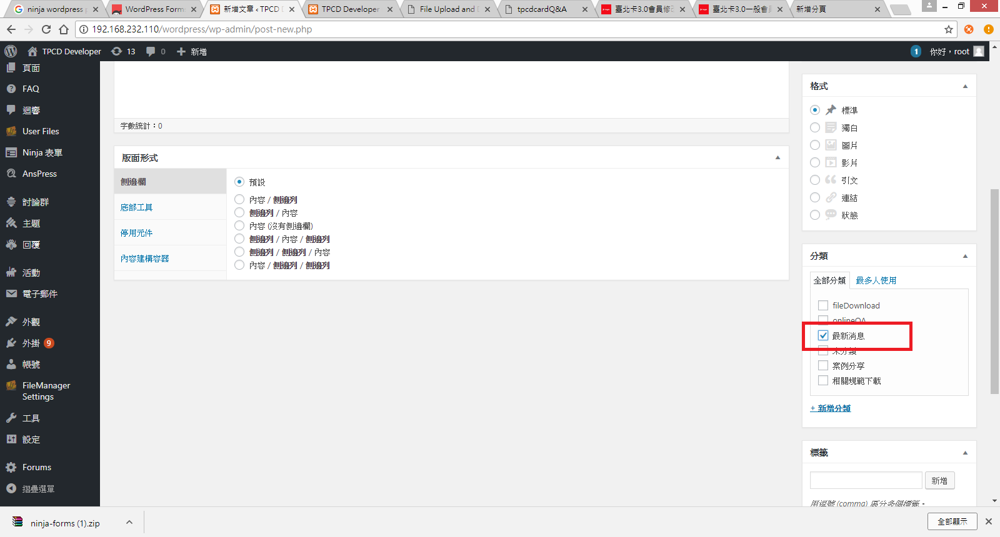
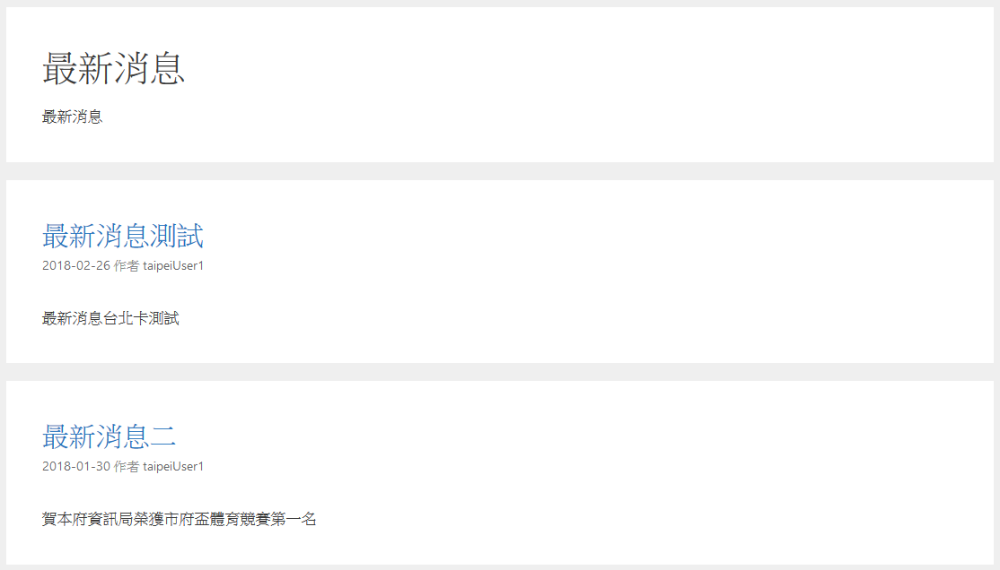

#最近消息

 
 
 
###   功能說明:
### 使用wordpress介面，設定一區提供最新消息之內容，內容由相關人員整理上稿。

**********************************

####  上版說明

##### Step1.
#####    先以管理者身分新增wordpress文章
#####    並輸入文章的標題以及內容

##### Step2.
#####    在分類中勾選最近消息的分類

***********************************
##### 下圖為案例分享顯示的部分

