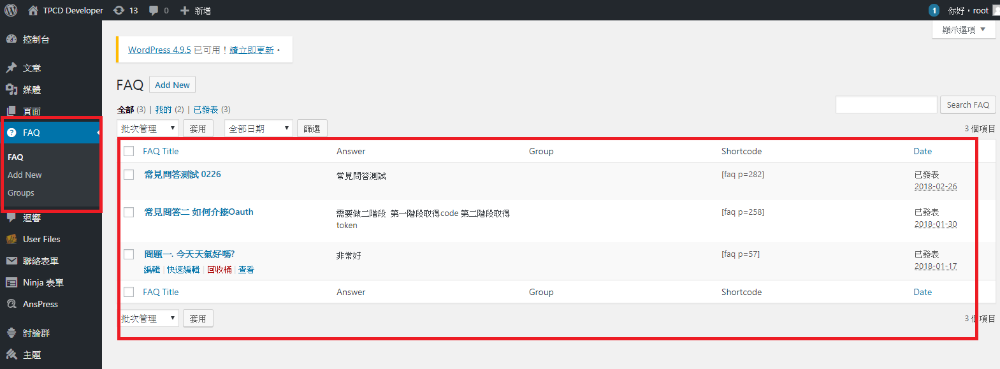
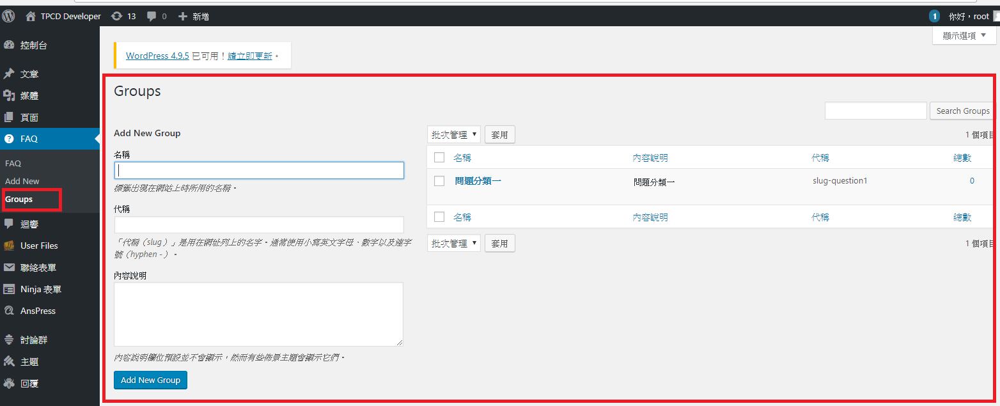
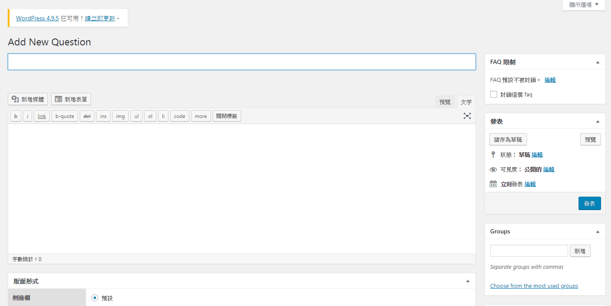
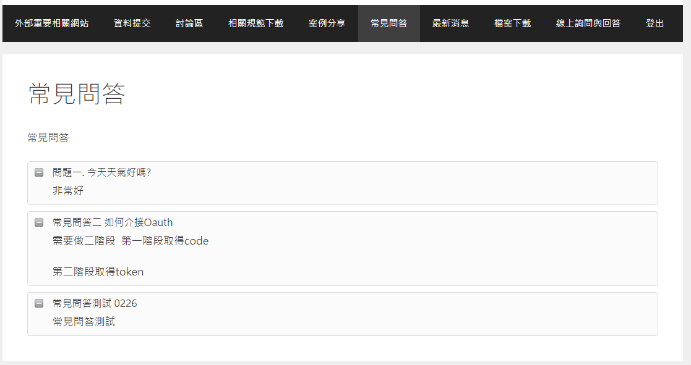

#常見問答

###   功能說明:
###   使用wordpress介面，設定一區提供常見問答之相關文章，
###   內容由相關人員整理上稿。

####  上版說明

##### Step1.
#####    先以管理者身分新增FAQ文章

##### Step2.
#####    在分類中勾選新增Group的分類

##### Step3.
#####    在分類中勾選新增new Question的部分

***********************************
#### 下圖為案例分享顯示的部分

