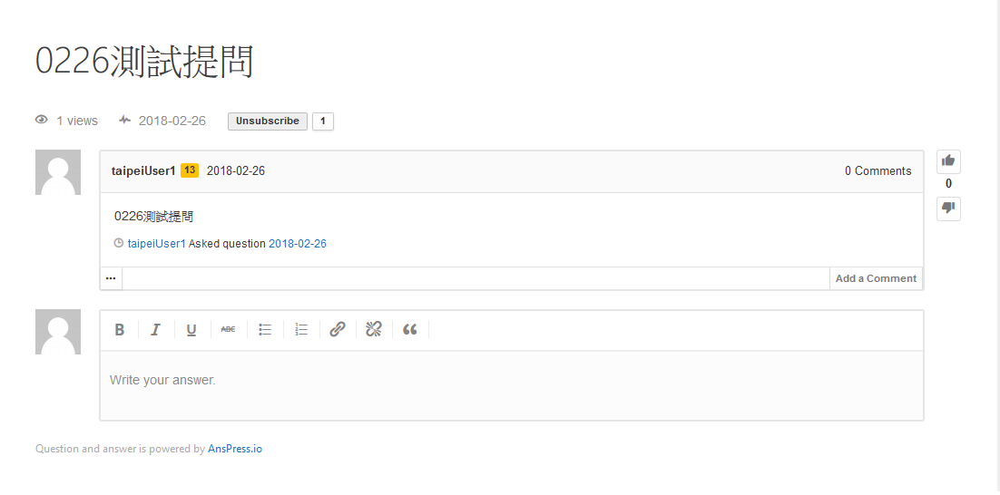

#OnlineQA

 
 
 
###   功能說明:
###   使用wordpress介面，設定一區提供會員進行台北卡系統相
###   關問題之反應，問題的答覆則以 email 或是電話回覆

***********************************
#### 線上問答使用的是 AnsPress Plugin
#### 操作步驟:
     Step1. 由管理者於管理介面的 AnsPress選項進行管理,並點選所有提問
            入點擊New question則可建立新的問題選項

    Step2.  由管理者於新增訊息中,將標題與內容輸入並點選發表

#### 下圖為線上問答提問的顯示部分
     這部分主要顯示線上提問的內容

#### 下圖為線上問答提問的發表回應部分
     這部分主要是回答使用者常見提問的問題

