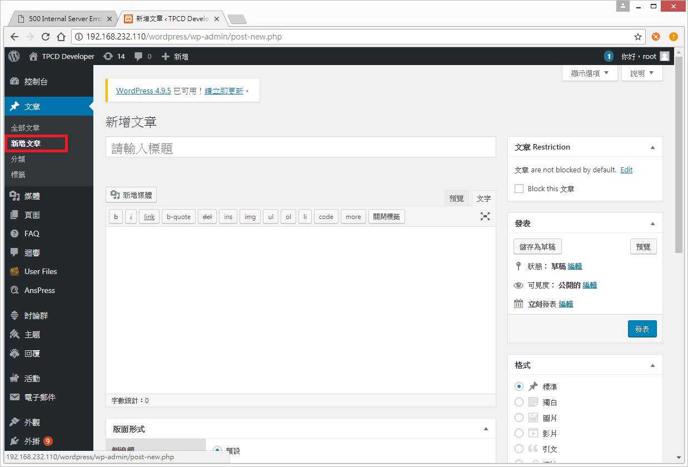
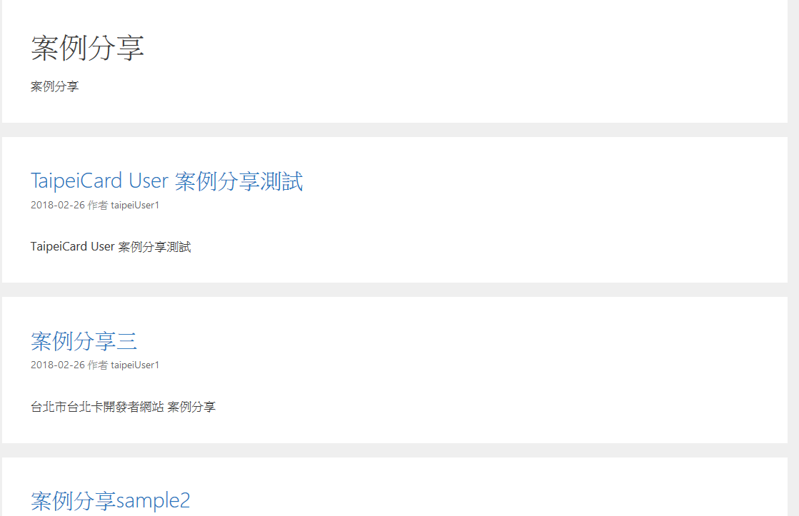

#案例分享

###   功能說明:
### 使用wordpress介面，設定一區提供案例分享的文章，內容
### 由相關人員整理上稿。

**********************************

####  上版說明

##### Step1.
#####    先以管理者身分新增wordpress文章
######    並於文章中輸入標題及內容

##### Step2.
#####    使用者在分類中勾選案例分享的分類

***********************************
#### 下圖為案例分享展示的部分
##### 分成幾篇的案例分享測試

