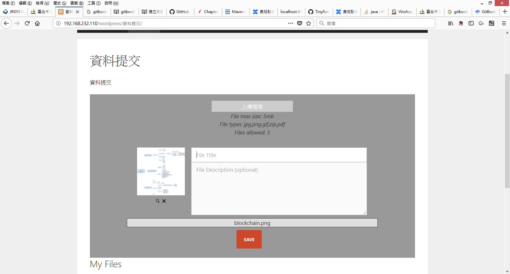

#資料提交操作流程  

###  內容說明: 
###使用wordpress介面設定一區提供會員進行資料提交提交的內容包括資料來源(如機關、人)、時間、主旨、說明、附件上傳。

1. 限制部分分成
          a. 上傳檔案格式限制:  檔案類型分成 jpg,png,gif,zip,pdf
          b. 上傳檔案大小限制:  5mb
          c. 單次上傳檔案限制:  5個檔案 

2. 並於圖中的部分打上主旨
   以及在Descrption處打上說明,資料來源(如機關、人)等

